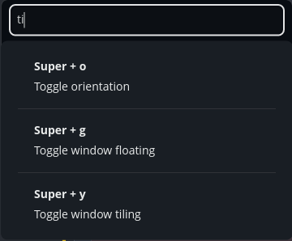
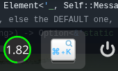

<div align="center">
  
  <h1>KeyPeek</h1>
  <p><strong>Quick peek at your COSMIC keyboard shortcuts</strong></p>
  
</div>

---

## Overview

KeyPeek is a convenient system panel applet for the COSMIC desktop environment that provides instant access to all your keyboard shortcuts. Simply click the applet icon in your panel to view a searchable list of all configured keyboard shortcuts.

## Features

- 📋 **Complete Shortcut List**: View all COSMIC keyboard shortcuts in one place
- 🔍 **Real-time Search**: Quickly filter shortcuts by description as you type
- 🎨 **Clean Interface**: Keyboard bindings displayed in bold with wrapped descriptions
- 📜 **Scrollable View**: Easy navigation through all available shortcuts
- 🚀 **Instant Access**: Quick popup from the system panel

## Screenshots

### Search Functionality
Search through your shortcuts in real-time:



### Panel Placement
KeyPeek sits conveniently in your COSMIC panel:



## Installation

### Build from source

```bash
# Clone the repository
sudo apt install libxkbcommon-dev
git clone https://github.com/l-const/shortcuts-applet.git
cd shortcuts-applet

# Build the release version
just build-release

# Install (requires sudo)
sudo just install
```

After installation, you may need to restart your COSMIC panel or log out and back in for the applet to appear.

### Requirements

- COSMIC Desktop Environment
- Rust toolchain (for building from source)
- `just` command runner

## Usage

1. **Locate the icon**: Look for the KeyPeek icon (⌘ + K) in your COSMIC panel
2. **Click to open**: Click the icon to open the shortcuts popup window
3. **Search**: Type in the search box at the top to filter shortcuts by description
4. **Browse**: Scroll through the list to discover all available keyboard shortcuts
5. **Click outside** or press `Esc` to close the popup

## Development

```bash
# Run in development mode
just run

# Build for release
just build-release
```

## Configuration

KeyPeek automatically loads shortcuts from your COSMIC settings configuration. No additional configuration is needed. The applet will display all keyboard shortcuts configured in your COSMIC desktop environment.

## Technical Details

- **App ID**: `io.github.lconst.keypeek`
- **Language**: Rust
- **Framework**: libcosmic
- **License**: MIT

## Contributing

Contributions are welcome! Please feel free to submit issues or pull requests.

## License

MIT License - see [LICENSE](LICENSE) for details.

## Acknowledgments

Built with [libcosmic](https://github.com/pop-os/libcosmic) for the COSMIC desktop environment.
